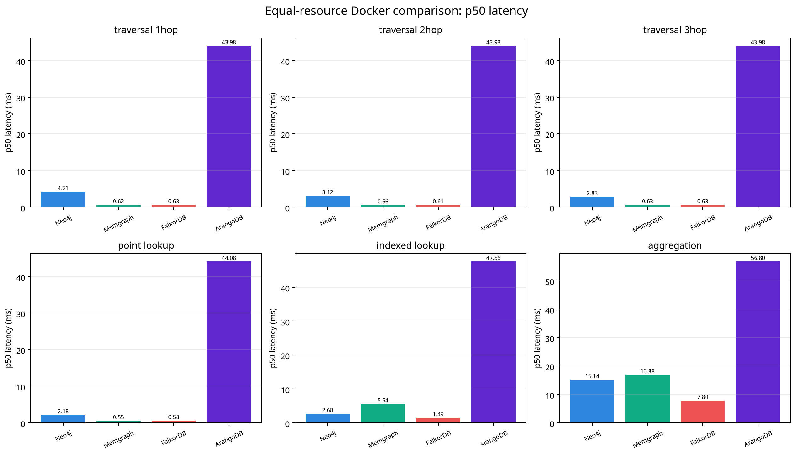
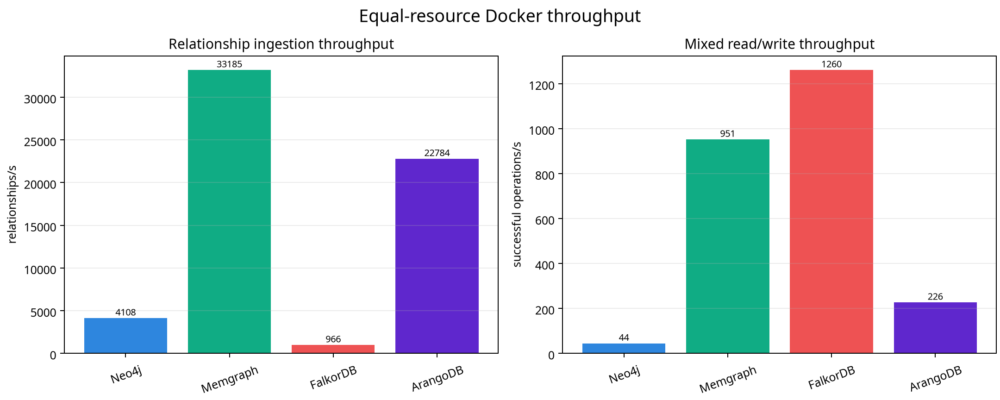

# Graph Database Cloud Benchmark

I designed this project to compare CognoDB Cloud with four other graph database engines using one public graph topology, one benchmark client, one reproducible workload suite, and percentile-based reporting. The implementation keeps each database protocol inside its adapter so that protocol differences remain visible in the methodology rather than being hidden behind a misleading common abstraction.

The final measurements contain five successful runs. Neo4j Community, Memgraph, FalkorDB Server, and ArangoDB ran sequentially in Docker with identical declared limits of **0.5 CPU, 512 MB RAM, and a 1 GB writable layer**. CognoDB ran from the same laptop as a managed c0 reference with **0.5 burstable vCPU, 256 MB RAM, and 1 GB disk**. CognoDB is therefore reported separately and is not included in the equal-resource Docker ranking.

## Scope and platform selection

I selected four comparison engines that represent different graph storage and query interfaces:

| Platform | Version or tier | Client protocol | Resource record |
|---|---|---|---|
| CognoDB Cloud | c0 free instance | Bolt + Cypher | 0.5 burstable vCPU; 256 MB RAM; 1 GB disk; `us-east4` |
| Neo4j Community | `neo4j:2026.07.1` | Bolt + Cypher | 0.5 CPU; 512 MB RAM; 1 GB writable layer |
| Memgraph | `memgraph/memgraph:2.14.1` | Bolt + Memgraph dialect | 0.5 CPU; 512 MB RAM; 1 GB writable layer |
| FalkorDB Server | `falkordb/falkordb-server:latest` | Redis + OpenCypher | 0.5 CPU; 512 MB RAM; 1 GB writable layer |
| ArangoDB | `arangodb:3.12.4` | HTTP REST + AQL | 0.5 CPU; 512 MB RAM; 1 GB writable layer |

The four Docker services form the equal-resource comparison. CognoDB c0 is a contextual managed reference because the supplied CognoDB access provisions a hosted instance rather than a local Docker peer. This distinction prevents a 512 MB local container from being presented as directly equivalent to a 256 MB managed instance.

The resource-parity policy is documented in [`config/resource-parity.md`](config/resource-parity.md). Docker inspection records in [`results/final/`](results/final/) preserve the declared CPU, memory, and storage limits used for the local comparison.

## Dataset

I used the official Stanford Network Analysis Project **soc-Pokec** relationship graph. SNAP reports 1,632,803 nodes and 30,622,564 directed edges in the full graph [1]. The preparation script downloads the official relationship file and creates a deterministic prefix sample containing **150,000 non-self-loop relationships and 74,062 nodes**.

The same `nodes.csv` and `edges.csv` files were loaded into every target. The graph is directed, and the benchmark preserves the source edge orientation. The source relationship file is anonymized, so I add stable benchmark-only properties derived from anonymized IDs: `name`, `country`, and `age`. These annotations exist to exercise point lookup, filtered lookup, and aggregation workloads; they are not presented as original Pokec profile claims.

The dataset metadata is recorded in [`data/pokec_sample/MANIFEST.md`](data/pokec_sample/MANIFEST.md). To regenerate the sample from the public source:

```bash
python scripts/prepare_pokec.py --out data/pokec_sample --relationships 150000
```

## Docker comparison topology

The four local comparison engines run one at a time on the same Docker host as the benchmark client. Each service receives the same declared limits:

| Control | Value |
|---|---:|
| CPU | 0.5 CPU |
| Memory | 512 MB |
| Writable storage layer | 1 GB |
| Execution mode | One database container at a time |
| Client | Same laptop and Python benchmark process |

The Compose definition is [`docker-compose.local.yml`](docker-compose.local.yml). Local endpoints are Neo4j at port `17687`, Memgraph at port `27687`, FalkorDB at port `36379`, and ArangoDB at port `18529`. I use ephemeral container storage for each run so that an earlier failed reset cannot affect a later measurement.

The Docker stack can be started with:

```bash
cp .env.docker.example .env.docker
docker compose --env-file .env.docker -f docker-compose.local.yml up -d
docker compose --env-file .env.docker -f docker-compose.local.yml ps
```

I verify the declared limits with:

```bash
docker inspect graphbench-neo4j graphbench-memgraph graphbench-falkordb graphbench-arango \
  --format '{{.Name}} cpus={{.HostConfig.NanoCpus}} memory_bytes={{.HostConfig.Memory}} storage={{json .HostConfig.StorageOpt}}'
```

The Docker resources are inspected rather than inferred from live usage. The four published inspection records show `500000000` nan CPUs, `536870912` bytes of memory, and a `1G` storage option for every local engine.

## Installation and configuration

I use Python 3.10 or later and install the project in a virtual environment:

```bash
python -m venv .venv
source .venv/bin/activate
python -m pip install --upgrade pip
pip install -e '.[dev]'
```

Windows Command Prompt can use the same package commands after activating its virtual environment. The benchmark reads credentials only from environment variables. The local `.env` and `.env.docker` files are ignored by Git and are not part of the published project.

The environment templates are:

| Purpose | File |
|---|---|
| Managed service configuration | `.env.example` |
| Local Docker configuration | `.env.docker.example` |

## Benchmark methodology

Every target receives the same dataset and the same logical workload sequence:

1. Connect and execute a health-check query.
2. Reset the benchmark graph.
3. Create the required indexes or equivalent schema objects.
4. Load all nodes and relationships in deterministic batches of 5,000 rows.
5. Verify that the loaded graph contains 74,062 nodes and 150,000 relationships.
6. Warm up every read workload with 10 calls.
7. Measure 100 iterations of every read workload.
8. Measure 100 mixed operations at a stated concurrency of 10 clients with a 50% read and 50% write mix.
9. Preserve raw observations, failures, timing, load duration, and workload notes in JSON.

The read workloads are:

| Workload | Description |
|---|---|
| `traversal_1hop` | Directed one-hop traversal from deterministic start nodes |
| `traversal_2hop` | Directed two-hop traversal |
| `traversal_3hop` | Directed three-hop traversal |
| `point_lookup` | Lookup by `user_id` |
| `indexed_lookup` | Filtered lookup by indexed `country` |
| `aggregation` | Group-and-count aggregation by `country` |
| `mixed_read_write` | Concurrent 50% point reads and 50% writes at 10 clients |

The adapters use the native interface available to each engine. Neo4j, Memgraph, and CognoDB use Bolt-compatible drivers. FalkorDB uses its Redis/OpenCypher command interface [2] [3]. ArangoDB uses its REST cursor API and AQL. Percentiles use a deterministic nearest-rank calculation, and the raw JSON files retain the individual observations used to calculate them.

## Results

### Resource status

| Target | CPU | Memory | Storage | Comparison status |
|---|---:|---:|---:|---|
| Neo4j Community Docker | 0.5 CPU | 512 MB | 1 GB | Equal-resource Docker comparison |
| Memgraph Docker | 0.5 CPU | 512 MB | 1 GB | Equal-resource Docker comparison |
| FalkorDB Server Docker | 0.5 CPU | 512 MB | 1 GB | Equal-resource Docker comparison |
| ArangoDB Docker | 0.5 CPU | 512 MB | 1 GB | Equal-resource Docker comparison |
| CognoDB c0 | 0.5 burstable vCPU | 256 MB | 1 GB | Managed reference; not in Docker ranking |

### Read latency

The table reports p50 and p95 latency in milliseconds. Every row contains 100 successful measured observations and zero failed measured requests.

| Workload | Neo4j p50 / p95 | Memgraph p50 / p95 | FalkorDB p50 / p95 | ArangoDB p50 / p95 | CognoDB p50 / p95 |
|---|---:|---:|---:|---:|---:|
| 1-hop traversal | 4.21 / 80.43 | 0.62 / 1.23 | 0.63 / 0.81 | 43.98 / 47.64 | 263.42 / 266.14 |
| 2-hop traversal | 3.12 / 71.48 | 0.56 / 0.74 | 0.61 / 0.86 | 43.98 / 46.63 | 263.45 / 267.80 |
| 3-hop traversal | 2.83 / 76.58 | 0.63 / 1.32 | 0.63 / 0.98 | 43.98 / 47.69 | 263.82 / 281.39 |
| Point lookup | 2.18 / 6.30 | 0.55 / 0.72 | 0.58 / 0.76 | 44.08 / 47.19 | 263.06 / 264.91 |
| Indexed lookup | 2.68 / 55.91 | 5.54 / 49.25 | 1.49 / 2.00 | 47.56 / 49.05 | 281.40 / 318.19 |
| Aggregation | 15.14 / 101.61 | 16.88 / 66.21 | 7.80 / 56.35 | 56.80 / 60.27 | 398.06 / 473.45 |

### Ingestion and mixed workload

| Target | Load time (s) | Nodes/s | Relationships/s | Mixed throughput | Mixed p50 / p95 (ms) |
|---|---:|---:|---:|---:|---:|
| Neo4j Community Docker | 36.52 | 2,028.20 | 4,107.77 | 43.82 ops/s | 1,773.30 / 2,269.50 |
| Memgraph Docker | 4.52 | 16,384.89 | 33,184.82 | 951.19 ops/s | 78.35 / 95.54 |
| FalkorDB Server Docker | 155.26 | 477.02 | 966.12 | 1,260.44 ops/s | 13.76 / 69.71 |
| ArangoDB Docker | 6.58 | 11,249.74 | 22,784.44 | 226.24 ops/s | 212.01 / 404.62 |
| CognoDB c0 reference | 28.77 | 2,574.70 | 5,214.62 | 25.34 ops/s | 2,567.75 / 3,748.04 |

The generated machine-readable summary is [`results/final/summary.csv`](results/final/summary.csv), and the source summary is [`results/final/summary.md`](results/final/summary.md). The charts are [`results/final/p50-latency-docker.png`](results/final/p50-latency-docker.png) and [`results/final/throughput-docker.png`](results/final/throughput-docker.png).





## Analysis

FalkorDB had the lowest p50 latency for indexed lookup and aggregation among the four equal-resource Docker targets. It also delivered the highest mixed-workload throughput at approximately 1,260 successful operations per second. Its traversal and point-lookup p50 values were approximately 0.6–0.7 ms. Its main weakness was ingestion, at approximately 966 relationships per second.

Memgraph delivered the highest ingestion throughput at approximately 33,185 relationships per second and remained close to FalkorDB for traversal and point-lookup latency. Its indexed lookup and aggregation were slower than FalkorDB’s, while its mixed-workload throughput reached approximately 951 successful operations per second.

Neo4j completed all workloads under the same Docker limits, but its p95 latency was substantially higher than its p50 on several read workloads. This indicates a pronounced tail under the constrained 0.5 CPU / 512 MB environment. Its mixed-workload throughput was approximately 44 successful operations per second, and its ingestion throughput was approximately 4,108 relationships per second.

ArangoDB had the highest read p50 values in this comparison, although it ingested approximately 22,784 relationships per second. Its mixed-workload throughput was approximately 226 successful operations per second. These values use the REST/AQL adapter, so the result includes the practical cost and behavior of that protocol rather than a Bolt session.

CognoDB c0 loaded the graph at approximately 5,215 relationships per second and recorded approximately 25 successful mixed operations per second. Its read latencies include the laptop-to-managed-service path, TLS, routing, and service-side scheduling. They are useful as a managed reference, but they should not be interpreted as product-only latency against the local Docker results.

## Limitations

The four Docker services share one host and were measured sequentially. The resource controls are declared container limits; live usage varies by engine, and the effective enforcement of the writable-layer limit depends on the Docker backend. CognoDB is hosted remotely and uses a different fixed memory allocation, so it is separated from the equal-resource Docker ranking.

The dataset is a deterministic prefix sample rather than a statistically representative sample of the full soc-Pokec graph. The node properties used for filtered and aggregation workloads are benchmark annotations derived from anonymized IDs. FalkorDB, ArangoDB, and the Bolt-based engines also expose different query and transport interfaces, and those differences are part of the practical comparison.

The mixed-workload number is the sustained successful operation rate for the configured 50% read / 50% write task mix at 10 clients. It is not a vendor-independent database-QPS claim. Managed-service footprint values are reported only when exposed by the service; otherwise, the value is not observable.

## Reproducing the run

To run a local Docker target, start only the selected service and execute the corresponding command:

```bash
graphbench run --database neo4j_docker --data data/pokec_sample --out results/neo4j_docker.json --warmup 10 --iterations 100 --clients 10
graphbench run --database memgraph_docker --data data/pokec_sample --out results/memgraph_docker.json --warmup 10 --iterations 100 --clients 10
graphbench run --database falkordb_docker --data data/pokec_sample --out results/falkordb_docker.json --warmup 10 --iterations 100 --clients 10
graphbench run --database arango_docker --data data/pokec_sample --out results/arango_docker.json --warmup 10 --iterations 100 --clients 10
```

To regenerate the summary after all raw result files are present:

```bash
graphbench report --results results --markdown results/summary.md --csv results/summary.csv
```

The final analysis package was generated with:

```bash
python scripts/build_final_report.py --input results-archive --output results/final
```

## References

[1]: https://snap.stanford.edu/data/soc-Pokec.html "SNAP soc-Pokec social network dataset"
[2]: https://docs.falkordb.com/design/client-spec.html "FalkorDB client specification and compact result format"
[3]: https://docs.falkordb.com/commands/graph.query "FalkorDB GRAPH.QUERY command"
[4]: https://neo4j.com/docs/operations-manual/current/docker/introduction/ "Neo4j in Docker"
[5]: https://memgraph.com/docs/getting-started/install-memgraph/docker "Install Memgraph with Docker"
